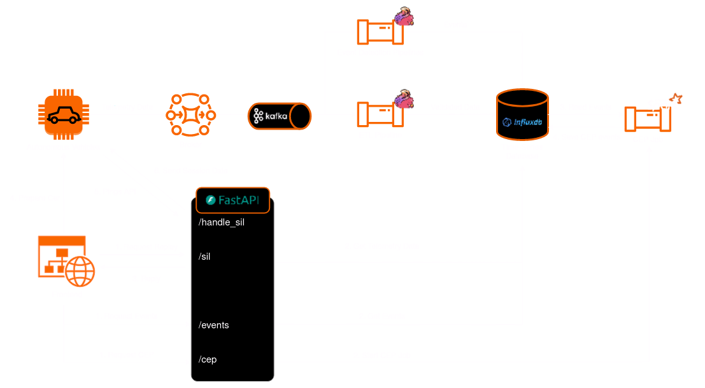

# DRIVER

## Directory Structure

- Apache Flink jobs: `./streaming`
- API: `./apis/api`
- SIL car receiver template: `./apis/sil_receiver`
- GUI: `./gui`

## Apache Flink Jobs

[Apache Flink](https://flink.apache.org/) 1.17 is used to implement streaming pipelines, which stream data from the [Apache Kafka](https://kafka.apache.org/) cluster. There as two kinds of pipelines;

1. ETL pipeline
2. Event pipelines.

The ETL pipeline is responsible for saving the cars' telemetry data to the [InfluxDB](https://www.influxdata.com/) database. The code for the ETL pipeline can be found at `./streaming/etl_pipeline`.

The event pipelines are responsible for identifying simple events from the data. The code for the event pipelines can be found at `./streaming`. The event types detected by DRIVER are listed below.

- Sudden Braking
- GPS Not Updating
- CPU High Load
- GPU High Load
- Not Reporting
- Low FPS

## API

THe API serves data from the InfluxDB database to the GUI of the DRIVER application. The file at `./apis/api/main.py` combines the various submodules of the API. The API's endpoints are also defined there. Complex event processing (CEP) is implemented in the `./apis/api/cep/cep_finder.py` file. Meanwhile, the core logic for the SIL is at the `main.py` file.

## SIL Car Receiver Template

The template for the creating the car-side part of the SIL feature is located at `./apis/sil_receiver`. This template was provided to VROOM to assist with ingesting messages sent via the SIL.

## GUI

The frontend of the application consists of a web platform, implemented using the popular [ReactJS](https://react.dev/) JavaScript framework.

Our team created the `EventsScreen.jsx` screen to display events in real-time and the `SilMenu.jsx` component for the main screen, to initiate the SIL process.

## Diagram

